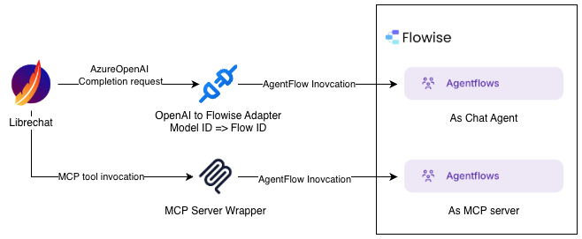

# LibreChat Flowise Integration

This directory contains an OpenAI-compatible proxy server that converts OpenAI API requests to Flowise prediction API calls.

## Overview

The integration provides:
- **OpenAI-compatible HTTP server** - Accept OpenAI API requests and proxy them to Flowise
- **Format adapters** - Convert between OpenAI and Flowise request/response formats
- **FlowiseClient** - Direct Python client for Flowise API
- **Multi-flow support** - Use the OpenAI `model` field to specify which Flowise flow ID to use. Different flows can be accessed by passing different flow IDs as the model parameter. (See `openai_compatible_server.py` lines 97-99 and 138-140 where `flow_id = deployment_name or body.get("model")`)

## Architecture



## Files

- **openai_compatible_server.py** - Main Flask server that accepts OpenAI API requests
- **flowise_client.py** - Python client for Flowise API with retry logic
- **openai_adapter.py** - Format converters (OpenAI ↔ Flowise)
- **server_test.py** - Tests using Azure OpenAI SDK
- **client_test.py** - Tests using FlowiseClient directly
- **requirements.txt** - Python dependencies
- **.env** - Environment configuration (API keys, URLs)
- **sample_payload/** - Example request/response JSON files

## Setup

### 1. Install Dependencies

```bash
pip install -r requirements.txt
```

### 2. Configure Environment

Create or update `.env` file:

```bash
FLOWISE_API_KEY=your_api_key_here
FLOWISE_BASE_URL=https://demo.flow.legaleagle-ai.com/api/v1
```

**Note:** Do not include `/prediction` in the base URL - it's added automatically.

### 3. Start the Server

```bash
python3 openai_compatible_server.py
```

The server will start on `http://localhost:8000` (configurable via `PORT` env var).

## Usage
### Use in Librechat add endpoint in `librechat.yaml`
To use a flow in Librechat
```
endpoints:
  azureOpenAI:
    titleModel: "gpt-4o"
    plugins: false
    groups:
      - group: "azure-openai"
        apiKey: "0c9********"
        instanceName: "easyorder"
        version: "2024-12-01-preview"
        models:
          gpt-4o:
            deploymentName: gpt-4o
            version: "2024-12-01-preview"

  custom:
    - name: "Flowise Local"
      # type: "openai" 
      apiKey: "none"                          # or "user_provided" or your key
      baseURL: "http://localhost:8000/v1"
      models:
        default: ["5518949f-3ebc-4082-af01-fa2a18623da6"]
        fetch: false                          # Flowise /v1/models is optional / non-standard
        stream: false
      titleConvo: true
      titleModel: "5518949f-3ebc-4082-af01-fa2a18623da6"
      summarize: false
      forcePrompt: false
      modelDisplayLabel: "Flowise Local"
```

### Using OpenAI SDK

The `model` parameter is used as the Flowise flow ID:

```python
from openai import AzureOpenAI

client = AzureOpenAI(
    azure_endpoint="http://localhost:8000",
    api_version="2023-05-15",
    api_key="dummy-key"  # Not validated by our server
)

response = client.chat.completions.create(
    model="5518949f-3ebc-4082-af01-fa2a18623da6",  # Your Flowise flow ID
    messages=[
        {"role": "user", "content": "What is the price for Apple?"}
    ]
)

print(response.choices[0].message.content)
\n+# Streaming example
stream = client.chat.completions.create(
  model="5518949f-3ebc-4082-af01-fa2a18623da6",
  messages=[{"role": "user", "content": "Write a haiku about mountains"}],
  stream=True
)
for chunk in stream:
  if chunk.choices and chunk.choices[0].delta and getattr(chunk.choices[0].delta, "content", None):
    print(chunk.choices[0].delta.content, end="")
  if chunk.choices and chunk.choices[0].finish_reason:
    print("\n[FINISH]", chunk.choices[0].finish_reason)
```

### Using curl

```bash
curl http://localhost:8000/v1/chat/completions \
  -H "Content-Type: application/json" \
  -d '{
    "model": "5518949f-3ebc-4082-af01-fa2a18623da6",
    "messages": [{"role": "user", "content": "Hello"}]
  }'
```

#### Streaming (Server-Sent Events)
Add `"stream": true` to receive incremental chunks following the OpenAI SSE spec:

```bash
curl -N http://localhost:8000/v1/chat/completions \
  -H "Content-Type: application/json" \
  -d '{
    "model": "5518949f-3ebc-4082-af01-fa2a18623da6",
    "messages": [{"role": "user", "content": "Tell me a short story about a fox."}],
    "stream": true
  }'
```

Sample output (truncated):
```
data: {"id":"flowise-1731060000000","object":"chat.completion.chunk","created":1731060000,"model":"5518949f-3ebc-4082-af01-fa2a18623da6","choices":[{"index":0,"delta":{"role":"assistant"},"finish_reason":null}]}

data: {"id":"flowise-1731060000000","object":"chat.completion.chunk","created":1731060000,"model":"5518949f-3ebc-4082-af01-fa2a18623da6","choices":[{"index":0,"delta":{"content":"Once upon a"},"finish_reason":null}]}

...

data: {"id":"flowise-1731060000000","object":"chat.completion.chunk","created":1731060001,"model":"5518949f-3ebc-4082-af01-fa2a18623da6","choices":[{"index":0,"delta":{},"finish_reason":"stop"}]}

data: [DONE]
```

For legacy completions streaming, use `/v1/completions` with `"stream": true` and parse similar `data:` lines with `object: "text_completion"`.

### Using FlowiseClient Directly

```python
from flowise_client import FlowiseClient

client = FlowiseClient(
    base_url="https://demo.flow.legaleagle-ai.com/api/v1",
    flow_id="5518949f-3ebc-4082-af01-fa2a18623da6",
    api_key="your_api_key"
)

response = client.predict("What is the price for Apple?")
print(response)
```

## Endpoints

### Health Check
- `GET /health` - Returns `{"status": "ok"}`

### Chat Completions (Recommended)
- `POST /v1/chat/completions` - OpenAI chat completion format
- `POST /openai/deployments/{deployment_name}/chat/completions` - Azure OpenAI format

### Legacy Completions
- `POST /v1/completions` - OpenAI completion format
- `POST /openai/deployments/{deployment_name}/completions` - Azure OpenAI format

## Testing

### Test the Server
```bash
# Start server first
python3 openai_compatible_server.py

# In another terminal, run tests
python3 server_test.py
```

### Test FlowiseClient
```bash
python3 client_test.py
```

### Test Format Conversion
```bash
python3 openai_adapter.py
```

## Configuration

### Environment Variables

| Variable | Required | Description | Example |
|----------|----------|-------------|---------|
| `FLOWISE_BASE_URL` | Yes | Flowise API base URL (without /prediction) | `https://demo.flow.legaleagle-ai.com/api/v1` |
| `FLOWISE_API_KEY` | Yes | Flowise API authentication key | `SoykdSCj-7KslJ48...` |
| `PORT` | No | Server port (default: 8000) | `8000` |
| `FLOWISE_REQUEST_TIMEOUT` | No | Request timeout in seconds (default: 30) | `30` |

### Multi-Flow Support

The server supports multiple Flowise flows without restart. Simply specify different flow IDs as the `model` parameter:

```python
# Flow 1
response1 = client.chat.completions.create(
    model="flow-id-1",
    messages=[...]
)

# Flow 2  
response2 = client.chat.completions.create(
    model="flow-id-2",
    messages=[...]
)
```

The server caches clients per flow ID for performance.

## Integration with LibreChat

### Phase 1: Custom Endpoint (Current)
Add the proxy server as a custom endpoint in `librechat.yaml`:

```yaml
endpoints:
  custom:
    - name: "Flowise"
      apiKey: "dummy-key"
      baseURL: "http://localhost:8000/v1"
      models:
        default: ["5518949f-3ebc-4082-af01-fa2a18623da6"]
      titleConvo: true
      titleModel: "current_model"
```

### Phase 2: Dynamic Model Management (Planned)
Add a Flowise model management method without requiring server restart.

## Error Handling

The server includes:
- Automatic retries (3 attempts with exponential backoff)
- Request timeouts (30s default)
- Detailed error logging
- OpenAI-compatible error responses

## Development

### Project Structure
```
flowise_integration/
├── openai_compatible_server.py  # Main Flask server
├── flowise_client.py            # Flowise API client
├── openai_adapter.py            # Format converters
├── server_test.py               # Server integration tests
├── client_test.py               # Client unit tests
├── requirements.txt             # Dependencies
├── .env                         # Configuration
├── sample_payload/              # Test data
│   ├── flowise_raw.json
│   └── openai_raw.json
└── readme.md                    # This file
```

## Reference
- [Flowise Prediction API](https://docs.flowiseai.com/using-flowise/prediction)
- [OpenAI API Reference](https://platform.openai.com/docs/api-reference)
- [Azure OpenAI Service](https://learn.microsoft.com/en-us/azure/ai-services/openai/)

## Troubleshooting

### 404 Not Found
- Ensure server is running: `python3 openai_compatible_server.py`
- Check the base URL doesn't include `/prediction`
- Verify you're using the correct endpoint path

### Connection Refused
- Check if server is running on the expected port
- Verify firewall settings
- Confirm `PORT` env var if using non-default port

### Invalid Flow ID
- The `model` field must be a valid Flowise flow ID
- Check your Flowise dashboard for the correct flow ID
- Flow IDs are UUIDs like `5518949f-3ebc-4082-af01-fa2a18623da6`

### Authentication Errors
- Verify `FLOWISE_API_KEY` in `.env` is correct
- Check the API key has access to the specified flow
- Ensure `.env` file is in the `flowise_integration/` directory


